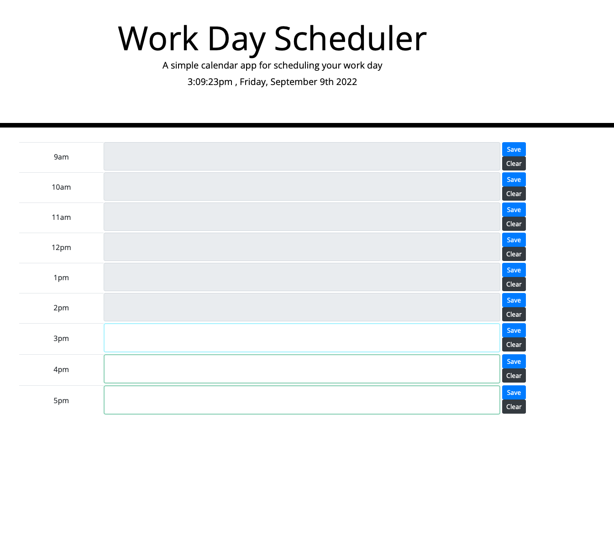

# WeekFive_FS

## Description

The app allows the users to save, clear and update their notes on a daily basis. To achieve this I integrated local storage to locally save the notes during reloads.

- Pass notes are colored grey.
- Current notes are bordered blue.
- Future notes are green.

This project used HTML, CSS, JavaScript and JQuery.

## Technologies User

- HTML
- CSS
- JQuery

Deployed Link: https://frsargua.github.io/WeekFive_FS/

# License

This project is not covered by a license.

## Contributing

## Tests

No tests available for this task.

## Questions:

GitHub: https://github.com/frsargua

email: frsargua@gmail.com
